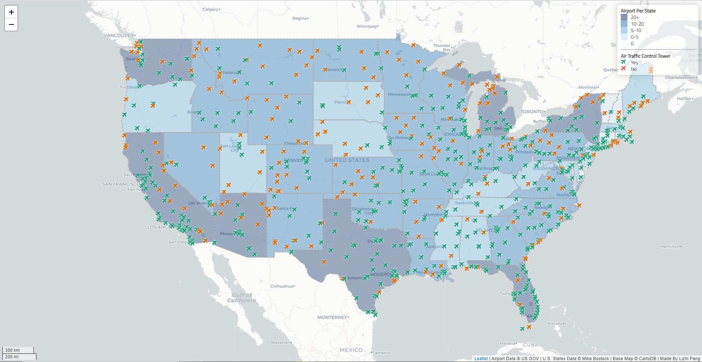

# US Airport Distribution Report

## Lizhi Peng

This interactive web map shows the active airports in United States as of the time the data was collected. The goal is to provide an easy to understand visualization for users who wish to compare accessibility to airports in different states.

Each airport shows on the map as an interactive icon, clicking on it shows a popup that displays the airport's name and the city it is located in. A green icon means the airport has its own air traffic control tower, orange means it does not. The color of each state is determined by the number of airports in that states.

The data used in this project comes from [U.S. Government](https://catalog.data.gov/dataset/usgs-small-scale-dataset-airports-of-the-united-states-201207-shapefile) and [D3](https://d3js.org/), made with [leaflet](https://leafletjs.com/).
